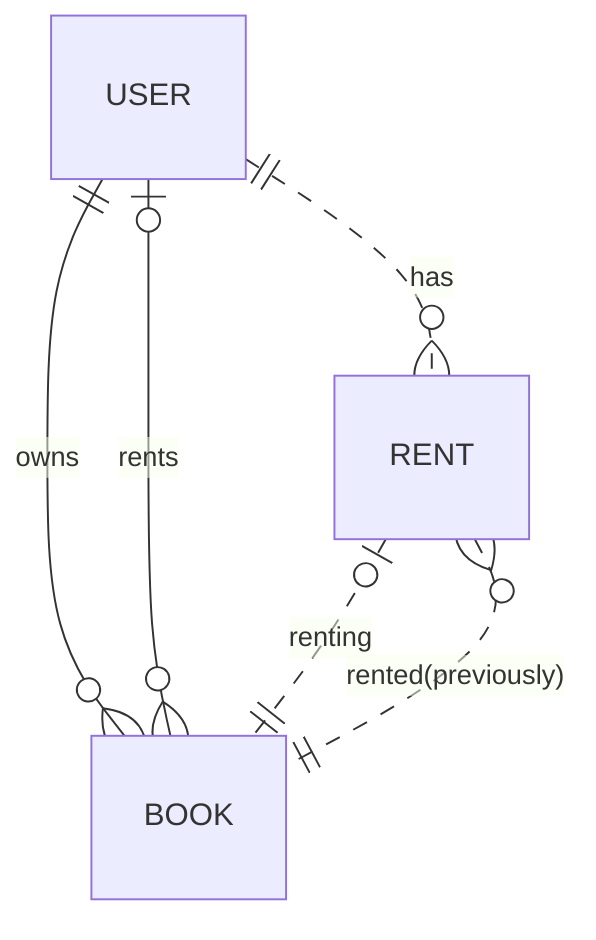
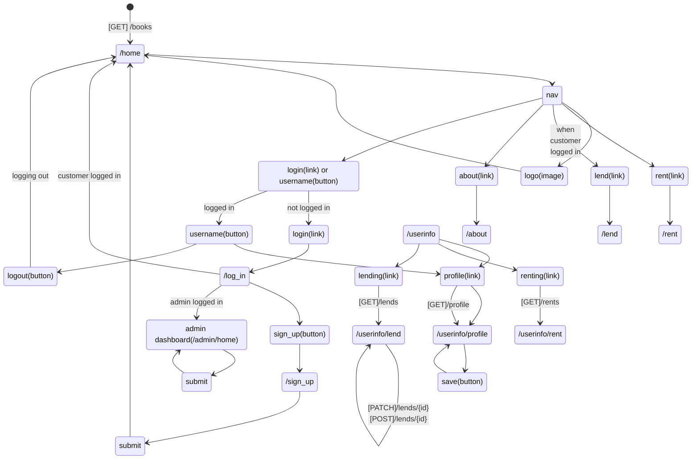
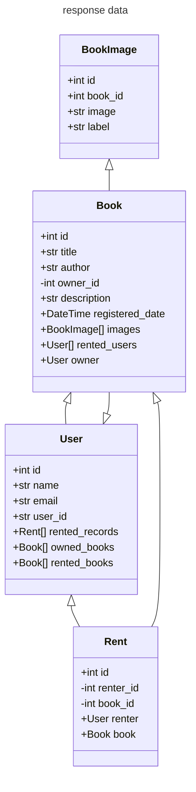
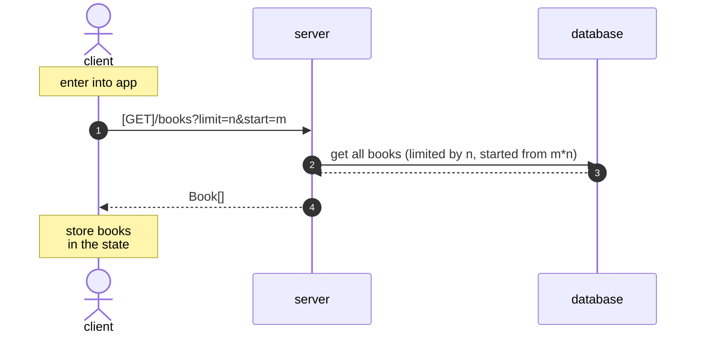
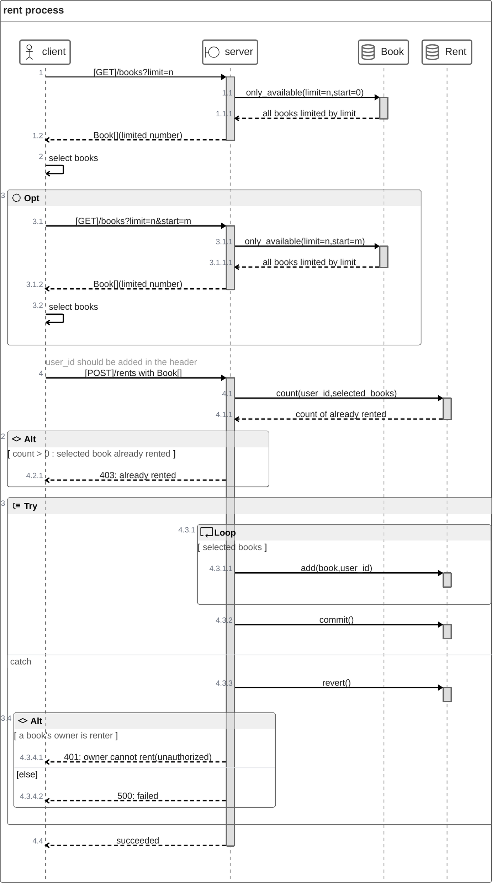
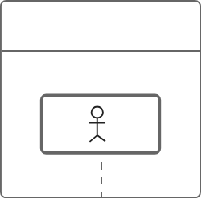

# book-share

platform to share books

## requirements

- book owner can register their books to lend
- renter can rent books
- renter/lender can sign-up / log-in
- on book list, renter can select books and rent books
- on account page, renter can confirm the renting books
- on account page, lender can confirm their books which is currently lending with renter
-

## model design

## ui route design

## backend rounte design

## client-server communication

### enter app (/home)

### rent (/rent)

## lend

